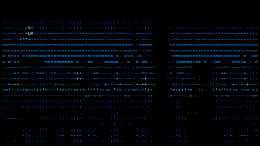

  

<h1 align="center">Hi, I'm Vedant Bhagat</h1>

  Computer Science @ Centre College · Class of 2028 
  Building games, esports software, and low-level systems. 
  <em>Creating, destroying, and rebuilding_</em>

  <a href="https://unemploymentavoidance.itch.io/">Play our games</a>
  ·
  <a href="https://www.linkedin.com/in/vedant-bhagat/">LinkedIn</a>

Co-founder and software developer at **Unemployment Avoidance Studios**, a two-person indie game studio.

## Selected Projects

### 🎮 Pieced To Be Alive

**Godot · GDScript**

Co-developed a 3D narrative puzzle game in 96 hours for GMTK Game Jam 2026. Play as a ghost solving puzzles to revive yourself before time runs out.

Released on Windows through itch.io. Currently polishing the game with my teammate for a planned free Steam release.

[Download the game](https://unemploymentavoidance.itch.io/pieced-to-be-alive)

### 📊 Centre Esports Analytics & Operations Platform

**React · TypeScript · Express · PostgreSQL · Prisma**

Built an internal platform approved for use by Centre College Esports, organizing competitive data across **4 teams and 27+ players**.

Designed relational workflows for matches, rosters, and VALORANT performance, alongside an idempotent import pipeline for historical match records with duplicate prevention and source traceability.

### ⚙️ ByteForge

**C · AArch64 Assembly · Raspberry Pi 5**

Built a bare-metal kernel featuring startup code, firmware mailbox communication, framebuffer text rendering, and a command-dispatch shell.

Ported the project from Raspberry Pi Zero to Pi 5. Input and storage currently use demonstration implementations; physical USB keyboard support remains experimental.

[Explore the code and build instructions](https://github.com/BhagatVedant/ByteForge)

## Technologies I Use

- **Game development:** Godot, GDScript, data-driven gameplay systems
- **Web & backend:** TypeScript, JavaScript, React, Node.js, Express, PostgreSQL, Prisma
- **Systems & tools:** C, AArch64 Assembly, Python, Git, Linux, Make
